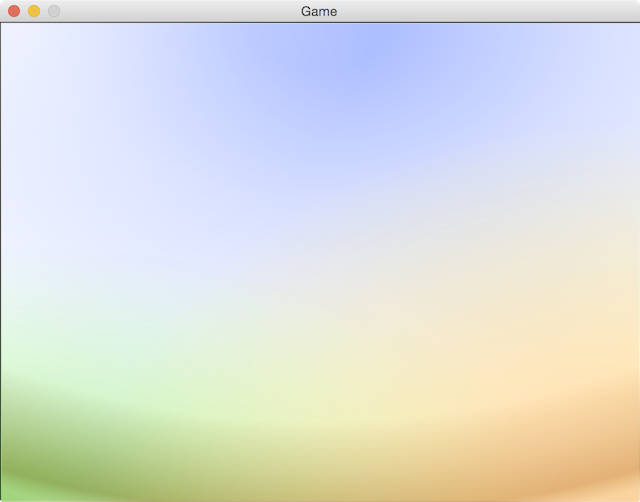
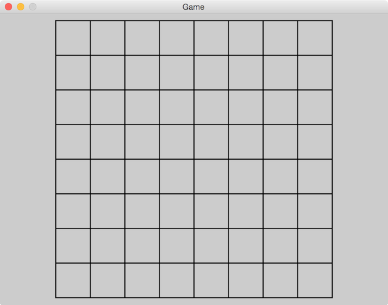
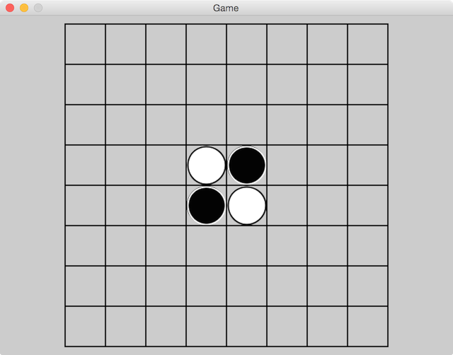
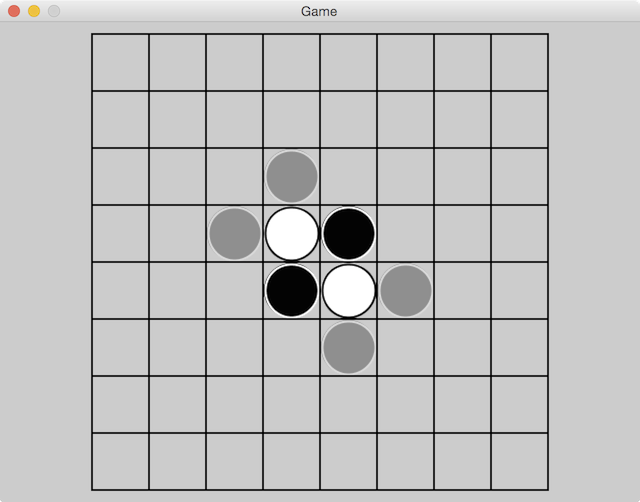
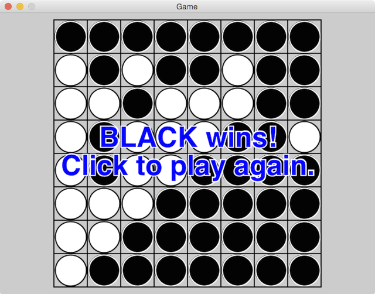

# Reversi tutorial

Here we explain how to make a simple [Reversi] game, from scratch, using PlayN. You may wish to
read the [overview](overview.html) before doing this tutorial, or just jump in and then refer back
to the overview if you run into anything confusing.

*Note*: this tutorial assumes you know how to program in Java. If you've never written Java code
but know some other language pretty well, you'll probably be fine. If you're new to Java *and*
programming, you'll need to work through a proper [Java
tutorial](http://www.google.com/search?q=Java+tutorial) first, because we're not going to spell out
every tiny detail here.

Before we get started, you need to do two important things:

* Set up your [development environment](setup.html)
* Create a [skeleton game](skeleton.html)

For the second step, this tutorial will assume that you used the following configuration when
creating your skeleton game:

* `groupId` - `io.playn.tutorial`
* `artifactId` - `reversi`
* `version` - `1.0-SNAPSHOT`
* `package` - `reversi`
* `JavaGameClassName` - `Reversi`

You can use whatever you like, but when we talk about particular classes, you'll have to remember
to mentally translate the names.

If you are having trouble getting Maven archetype generation working, or you just don't want to
bother, you can clone the [Reversi tutorial] project from Github. It contains the results of
invoking the Maven archetype generator with our suggested values.

Assuming you have a skeleton project, make sure you can run it and see the default rainbow
background:

```
cd reversi
mvn test -Pjava
```

If you're using an IDE, follow the same procedure outlined in the [development
environment](setup.html) instructions for running the game via your IDE.

You should see a window like this:



If you see the rainbow, then we're off to the races!

## Modeling

The first thing we need to do is come up with a data model for our game. This doesn't have anything
in particular to do with PlayN, but we can't get to any of the PlayN parts until we do it.

Reversi is a pretty simple game. There are two kinds of pieces, black and white. The board is 8x8
but we'll structure things to support arbitrary sizes. Players take turns placing pieces, so we
need to keep track of who's turn it is. That's about it. We'll also need the logic of figuring out
whether a move is legal and which pieces to flip over when a move is made. These are closely
related because a move is only legal if it flips over at least one piece.

To keep things simple, we'll declare an enum to represent the two kinds of pieces, use a player's
respective piece to determine whether it's their turn, and use a reactive map from a board
coordinate to the piece that occupies it. Edit `Reversi.java` thusly:

```java
public class Reversi extends SceneGame {

  public static enum Piece { BLACK, WHITE }

  public static class Coord {
    public final int x, y;

    public Coord (int x, int y) {
      assert x >= 0 && y >= 0;
      this.x = x;
      this.y = y;
    }

    public boolean equals (Coord other) {
      return other.x == x && other.y == y;
    }
    @Override public boolean equals (Object other) {
      return (other instanceof Coord) && equals((Coord)other);
    }
    @Override public int hashCode () { return x ^ y; }
    @Override public String toString () { return "+" + x + "+" + y; }
  }

  public final int boardSize = 8;
  public final RMap<Coord,Piece> pieces = RMap.create();
  public final Value<Piece> turn = Value.create(null);

  // ...
}
```

[Value] and [RMap] are from the [React] reactive programming library. They allow us to build a
model which automatically supports adding listeners which are notified when anything changes. We'll
see how that works below when we start wiring things up.

If you cloned the [Reversi tutorial] project, you can see the code up to now by looking at the
[modeling](https://github.com/playn/reversi-tutorial/tree/modeling/core/src/main/java/reversi/core)
branch.

## Drawing

Now that we have a basic model for our game, we can jump right into drawing it. We'll get to game
logic and the general flow of the game later. We want to get something on the screen first because
we love pretty pictures.

### Drawing the board

We're going to create a [Layer] which draws the game board, so let's call it `BoardView`. We'll
start by just drawing the board grid and then work our way up to the pieces.

```java
public class BoardView extends Layer {
  private static final float LINE_WIDTH = 2;
  private final Reversi game;

  public final float cellSize;

  public BoardView (Reversi game, IDimension viewSize) {
    this.game = game;
    float maxBoardSize = Math.min(viewSize.width(), viewSize.height()) - 20;
    this.cellSize = (float)Math.floor(maxBoardSize / game.boardSize);
  }

  // we want two extra pixels in width/height to account for the grid lines
  @Override public float width () { return cellSize * game.boardSize + LINE_WIDTH; }
  @Override public float height () { return width(); } // width == height

  @Override protected void paintImpl (Surface surf) {
    surf.setFillColor(0xFF000000); // black with full alpha
    float top = 0, bot = height(), left = 0, right = width();

    // draw lines from top to bottom for each vertical grid line
    for (int yy = 0; yy <= game.boardSize; yy++) {
      float ypos = yy*cellSize+1;
      surf.drawLine(left, ypos, right, ypos, LINE_WIDTH);
    }

    // draw lines from left to right for each horizontal grid line
    for (int xx = 0; xx <= game.boardSize; xx++) {
      float xpos = xx*cellSize+1;
      surf.drawLine(xpos, top, xpos, bot, LINE_WIDTH);
    }
  }
}
```

We override `width` and `height`, which is not strictly necessary, but it will be convenient later
when we're doing the math to decide where to position the board view in the main game view.

The method that does all the work is `paintImpl`. Every [Layer] draws itself to a [Surface]. This
is an accelerated drawing API where every drawing command results in a quad getting added to a
[QuadBatch] for eventual rendering by the GPU. In this case, we're drawing some lines. Lines are
just really skinny quads which are filled, in this case, by a solid color. We could also use
[Surface].`setFillPattern` to fill them with a texture, if we wanted to be fancy.

We choose a line thickness of two because that ensures that the board remains an even number of
pixels in size. If the board is an odd size, then when we center it in the display it's drawn on a
half-pixel boundary which can result in blurriness or pixels in unexpected places. So that's
something to keep in mind when you're laying things out.

Now let's wire up our `Model` and `BoardView` so that we can actually see something show up on the
screen. We'll also get rid of that rainbow background. Change the `Reversi` constructor thusly:

```java
  public Reversi (Platform plat) {
    super(plat, 33); // update our "simulation" 33ms (30 times per second)

    // figure out how big the game view is
    final IDimension size = plat.graphics().viewSize;

    // create a layer that just draws a grey background
    rootLayer.add(new Layer() {
      protected void paintImpl (Surface surf) {
        surf.setFillColor(0xFFCCCCCC).fillRect(0, 0, size.width(), size.height());
      }
    });

    // create and add a board view
    rootLayer.addCenterAt(new BoardView(this, size), size.width()/2, size.height()/2);
  }
```

Note that by having the `BoardView` know its size, we can use the `addCenterAt` method, which
positions a layer's center at a specified position. In our case we want the center of the board at
the center of the whole game view.

When you run the game, you should now see a nice grid on a grey background:



You can see the code up to this point by looking at the
[drawing-board](https://github.com/playn/reversi-tutorial/tree/drawing-board/core/src/main/java/reversi/core)
branch.

### Drawing the pieces

That's a nice grid, now let's draw some pieces. We could just modify `BoardView` to draw piece
textures directly after it is done drawing the grid, but for a variety of reasons, it will turn out
to be easier to have each piece placed into its own [ImageLayer], so we'll do it that way.

The `BoardView` is just for drawing the grid, so let's introduce a `GameView` class which will
contain the board as well as the pieces on top of it. The game view will be a [GroupLayer], which
is a layer that contains children. It will contain the `BoardView` layer, as well as [ImageLayer]s
for all the pieces. We'll start by just putting the `BoardView` in it:

```java
public class GameView extends GroupLayer {
  private final Reversi game;
  private final BoardView bview;
  private final GroupLayer pgroup = new GroupLayer();

  public GameView (Reversi game, IDimension viewSize) {
    this.game = game;
    this.bview = new BoardView(game, viewSize);
    addCenterAt(bview, viewSize.width()/2, viewSize.height()/2);
    addAt(pgroup, bview.tx(), bview.ty());
  }
}
```

and change `Reversi.java` thusly:

```java
-    // create and add a board view
-    rootLayer.addCenterAt(new BoardView(this, size), size.width()/2, size.height()/2);
+    // create and add a game view
+    rootLayer.add(new GameView(this, size));
```

`GameView` contains the `BoardView`, and it contains another `GroupLayer` (`pgroup`) which is going
to contain the piece layers. We position `pgroup` at the same location that we position the board
view so that coordinates in `bview` and `pgroup` are the same, which will come in handy later.

While we are in `Reversi.java`, we add a reference to the platform graphics:

```java
  public Graphics graphics() {
    return plat.graphics();
  }
```

Now we can get down to work on drawing some pieces. First we need to create some piece images,
which we'll do using the [Canvas] API. Change `GameView` like so:

```java
  private final Tile[] ptiles = new Tile[Piece.values().length];

  public GameView (Reversi game, IDimension size) {
    // ...

    // draw a black piece and white piece into a single canvas image
    float size = bview.cellSize-2, hsize = size/2;
    Canvas canvas = game.plat.graphics().createCanvas(2*size, size);
    canvas.setFillColor(0xFF000000).fillCircle(hsize, hsize, hsize).
      setStrokeColor(0xFFFFFFFF).setStrokeWidth(2).strokeCircle(hsize, hsize, hsize-1);
    canvas.setFillColor(0xFFFFFFFF).fillCircle(size+hsize, hsize, hsize).
      setStrokeColor(0xFF000000).setStrokeWidth(2).strokeCircle(size+hsize, hsize, hsize-1);

    // convert the image to a texture and extract a texture region (tile) for each piece
    Texture ptex = canvas.toTexture(Texture.Config.UNMANAGED);
    ptiles[Piece.BLACK.ordinal()] = ptex.tile(0, 0, size, size);
    ptiles[Piece.WHITE.ordinal()] = ptex.tile(size, 0, size, size);

    // dispose our pieces texture when this layer is disposed
    onDisposed(ptex.disposeSlot());
  }

  @Override public void close () {
    super.close();
    ptiles[0].texture().close(); // both ptiles reference the same texture
  }
```

We create a `ptiles` array to hold the [Tile] for each piece image. A [Tile] is just a sub-region
of a [Texture]. Though it is not particularly relevant in a game as simple as this, it's good
practice to combine things into a single texture whenever possible to improve rendering
performance. In this case, both of our piece images are in a single [Texture], but the [Tile] API
makes it simple to treat the region for each piece separately.

We do the actual piece drawing using the [Canvas] API. A piece is just a filled circle with a
stroked outline. Then we turn the canvas's [Image] \(which is a CPU memory bitmap) into a [Texture]
\(which is a GPU memory bitmap) via `toTexture`. Note that `toTexture` also disposes the [Canvas],
which is what we want because we don't need the canvas any longer. This frees up resources sooner
than if we just waited for the `Canvas` to be garbage collected. Finally we obtain our [Tile]s.

The texture for the pieces is `UNMANAGED` (see the [section on managed
textures](overview.html#texture-and-tile) in the overview). This is because we want the texture's
lifetime to correspond to the lifetime of `GameView`, not the lifetime of the layers that will
actually display the texture. If you have a texture which is no longer needed after the layers
which display it are disposed, you can use a managed texture; the layers will use reference
counting to ensure that the texture is disposed when the last layer which is using it is disposed.
In this case, we're going to use our piece texture in many image layers and there will be times
when we dispose all of our image layers before creating any new ones (which would trigger the
disposal of a managed texture). We don't want our piece texture to be disposed at that time; we
want to keep it until the whole `GameView` is disposed. Thus we make it unmanaged and manually
dispose it.

The piece images are a bit smaller than the cell size so that they don't overlap the grid lines or
bump right up next to them; it looks a bit nicer. To avoid having to do a bunch of fiddly math, we
position our pieces based on the center of a cell, as we'll see below. We align the center of the
piece to the center of the cell, so it doesn't matter if the piece is the same size as the cell, or
smaller, or bigger, it will always line up properly.

We could have made the texture the full size of the cell and just drawn a smaller circle inside it,
but rendering blank pixels is just as expensive as rendering filled pixels, so it would lower
rendering performance. That doesn't matter in this simple game, but we're trying to set a good
example.

Now we can create an [ImageLayer] for each piece using our piece tiles.

Add to `GameView` a map to track the layer for each piece on the board, and three new methods:

```java
  private final Map<Coord, ImageLayer> pviews = new HashMap<>();

  private ImageLayer addPiece (Coord at, Piece piece) {
    ImageLayer pview = new ImageLayer(ptiles[piece.ordinal()]);
    pview.setOrigin(Layer.Origin.CENTER);
    pgroup.addAt(pview, bview.cell(at.x), bview.cell(at.y));
    return pview;
  }

  private void setPiece (Coord at, Piece piece) {
    ImageLayer pview = pviews.get(at);
    if (pview == null) {
      pviews.put(at, addPiece(at, piece));
    } else {
      pview.setTile(ptiles[piece.ordinal()]);
    }
  }

  private void clearPiece (Coord at) {
    ImageLayer pview = pviews.remove(at);
    if (pview != null) pview.close();
  }
```

`addPiece` creates an [ImageLayer] to display a particular piece, positions it properly and adds it
to the scene graph. `setPiece` will add a new piece to the board, or update an existing piece. In
Reversi, we flip pieces over, so this will handle changing a piece from black to white or vice
versa. `clearPiece` will remove a piece from the board. Pieces are never removed in a Reversi game,
but this method will be used when we restart the game and remove all the pieces from the previous
game.

The `Layer.close()` method removes the layer from its parent and disposes any resources used by
that layer. In this case our piece layers contain non-managed textures, so the reference counting
they do on the underlying texture won't have any effect. But if we had a layer that contained a
managed texture for which it was the sole user, when that layer was disposed (via `close`) it would
in turn dispose its texture, which can often simplify texture memory management.

In `setPiece` we use `setOrigin` on the `ImageLayer` to indicate that we want to position the layer
based on its center rather than its upper left (which is the default). We then ask the `BoardView`
for the center of the desired grid cell (`bview.cell`), which is a method we'll need to add to
`BoardView`:

```java
  /** Returns the offset to the center of cell {@code cc} (in x or y). */
  public float cell (int cc) {
    // cc*cellSize is upper left corner, then cellSize/2 to center,
    // then 1 to account for our 2 pixel line width
    return cc*cellSize + cellSize/2 + 1;
  }
```

Recall that we positioned `pgroup` and `bview` at the same location, so the local coordinate
returned by `cell` is just what we need to position the piece layer inside `pgroup`.

The last bit of wiring we need is to react to the addition of pieces to the `Reversi.pieces` map
and create or update views for those pieces. Add the following to the end of the `GameView`
constructor:

```java
    game.pieces.connect(new RMap.Listener<Coord,Piece>() {
      @Override public void onPut (Coord coord, Piece piece) { setPiece(coord, piece); }
      @Override public void onRemove (Coord coord) { clearPiece(coord); }
    });
```

This adds a listener to the `pieces` reactive map which is notified whenever a map entry is `put`
or `remove`d. We make the appropriate changes to our views in response to those events.

You can try running the game, but you won't see pieces yet, because we haven't initialized the
game state. We need to add a method to `Reversi` to do that and then call it.

```java
  public Reversi (Platform plat) {
    // ...

    // create and add a game view
    rootLayer.add(new GameView(this, size));

    // start the game
    reset();
  }

  /** Clears the board and sets the 2x2 set of starting pieces in the middle. */
  private void reset () {
    pieces.clear();
    int half = boardSize/2;
    pieces.put(new Coord(half-1, half-1), Piece.WHITE);
    pieces.put(new Coord(half  , half-1), Piece.BLACK);
    pieces.put(new Coord(half-1, half  ), Piece.BLACK);
    pieces.put(new Coord(half  , half  ), Piece.WHITE);
    turn.updateForce(Piece.BLACK);
  }
```

Because we call `reset` *after* we create our `GameView`, the game view will already be listening
to the `pieces` map and be ready to hear about the pieces as they're added to the reactive map.

Note that we use `updateForce` to update the turn in `reset`. This is because the turn might
currently *be* `BLACK`, and when a reactive value is updated with the same value, it normally
ignores it. But we want to force the value to notify its listeners regardless because this is the
start of a new game and we don't want a stale value left over from a previous game to influence it.

Now we can run the game and we should see pieces:



Now we're ready to start working on game logic and flow.

You can see the code up to this point by looking at the
[drawing-pieces](https://github.com/playn/reversi-tutorial/tree/drawing-pieces/core/src/main/java/reversi/core)
branch.

## Logic and Game Flow

Before we handle user input, it will be useful to have the main game logic in place. So let's sort
that out. I'm not going to go into detail on the algorithm we use to process Reversi logic since
this tutorial is teaching you how to use PlayN, not how to implement the game of Reversi. We're
just going to do the simplest possible thing that works.

Create a `Logic.java` class with the following code:

```java
package reversi.core;

import java.util.ArrayList;
import java.util.List;
import java.util.Map;

import reversi.core.Reversi.Coord;
import reversi.core.Reversi.Piece;

/** "Does the math" for Reversi. */
public class Logic {
  public final int boardSize;

  public Logic (int boardSize) {
    this.boardSize = boardSize;
  }

  /** Returns true if the specified player can play a piece at the specified coordinate. */
  public boolean isLegalPlay (Map<Coord,Piece> board, Piece color, Coord coord) {
    if (!inBounds(coord.x, coord.y) || board.containsKey(coord)) return false;

    // look in each direction from this piece; if we see the other piece color and then one of our
    // own, then this is a legal move
    for (int ii = 0; ii < DX.length; ii++) {
      boolean sawOther = false;
      int x = coord.x, y = coord.y;
      for (int dd = 0; dd < boardSize; dd++) {
        x += DX[ii];
        y += DY[ii];
        if (!inBounds(x, y)) break; // stop when we end up off the board
        Piece piece = board.get(new Coord(x, y));
        if (piece == null) break;
        else if (piece != color) sawOther = true;
        else if (sawOther) return true;
        else break;
      }
    }

    return false;
  }

  /** Applies the specified play (caller must have already checked its legality).
    * Flips pieces as appropriate. */
  public void applyPlay (Map<Coord,Piece> board, Piece color, Coord coord) {
    List<Coord> toFlip = new ArrayList<>();
    // place this piece into the game state
    board.put(coord, color);
    // determine where this piece captures other pieces
    for (int ii = 0; ii < DX.length; ii++) {
      // look in this direction for captured pieces
      int x = coord.x, y = coord.y;
      for (int dd = 0; dd < boardSize; dd++) {
        x += DX[ii];
        y += DY[ii];
        if (!inBounds(x, y)) break; // stop when we end up off the board
        Coord fc = new Coord(x, y);
        Piece piece = board.get(fc);
        if (piece == null) break;
        else if (piece != color) toFlip.add(fc);
        else { // piece == color
          for (Coord tf : toFlip) board.put(tf, color); // flip it!
          break;
        }
      }
      toFlip.clear();
    }
  }

  /** Returns all legal plays for the player with the specified color. */
  public List<Coord> legalPlays (Map<Coord,Piece> board, Piece color) {
    List<Coord> plays = new ArrayList<>();
    // search every board position for a legal move; the force, it's so brute!
    for (int yy = 0; yy < boardSize; yy++) {
      for (int xx = 0; xx < boardSize; xx++) {
        Coord coord = new Coord(xx, yy);
        if (board.containsKey(coord)) continue;
        if (isLegalPlay(board, color, coord)) plays.add(coord);
      }
    }
    return plays;
  }

  private final boolean inBounds (int x, int y) {
    return (x >= 0) && (x < boardSize) && (y >= 0) && (y < boardSize);
  }

  protected static final int[] DX = { -1,  0,  1, -1, 1, -1, 0, 1 };
  protected static final int[] DY = { -1, -1, -1,  0, 0,  1, 1, 1 };
}
```

Then create a logic instance in `Reversi.java`:

```java
  public final int boardSize = 8;
  // ...
  public final Logic logic = new Logic(boardSize);
```

Now we need to implement turn handling. When it is a particular player's turn, we're going to
display all of their legal moves as partially transparent pieces. The player will click on one of
the partially transparent pieces to make their move and we'll process it and switch to the next
player's turn. If the other player has no moves then we end the game.

Let's start by adding a method to `GameView` to display potential moves.

```java
  public void showPlays (List<Coord> coords, Piece color) {
    final List<ImageLayer> plays = new ArrayList<>();
    for (Coord coord : coords) {
      ImageLayer pview = addPiece(coord, color);
      pview.setAlpha(0.3f);
      // TODO: listen for a click on pview and make that move
      plays.add(pview);
    }
  }
```

We'll leave the input handling for the [Input section](#input). Next let's wire up some logic in
`Reversi` which processes a turn:

```java
  public static enum Piece {
    BLACK, WHITE;
    public Piece next () { return values()[(ordinal()+1) % values().length]; }
  }

  public Reversi (Platform plat) {
    // ...

    // create and add a game view
    final GameView gview = new GameView(this, size);
    rootLayer.add(gview);

    // wire up a turn handler
    turn.connect(new Slot<Piece>() {
      private boolean lastPlayerPassed = false;
      @Override public void onEmit (Piece color) {
        List<Coord> plays = logic.legalPlays(pieces, color);
        if (!plays.isEmpty()) {
          lastPlayerPassed = false;
          gview.showPlays(plays, color);
        } else if (lastPlayerPassed) {
          endGame();
        } else {
          lastPlayerPassed = true;
          turn.update(color.next());
        }
      }
    });

    // start the game
    reset();
  }

  private void endGame () {
    // TODO
  }
```

This listens for changes to the `turn` reactive value. When it changes, it computes the legal moves
for the current turn holder and displays them in the game view. If a player has no legal moves,
play passes back to the other player. If both players have no legal moves, the game ends. We'll
handle ending the game later.

With all that in place, we can run the game now and should see the legal moves for the black player
(who starts the game):



Now we can start wiring up user input.

You can see the code up to this point by looking at the
[logic](https://github.com/playn/reversi-tutorial/tree/logic/core/src/main/java/reversi/core)
branch.

## Input

PlayN supports both [Mouse] and [Touch] input, as well as a unified input abstraction called
[Pointer], which provides a simple input model that can be fulfilled by either mouse or touch
input. [Pointer] is useful in that you can support both kinds of input without extra effort. You
can also augment a pointer-based UI with extra information from mouse or touch input as desired,
which we'll demonstrate here.

PlayN dispatches global input events which know nothing about the scene graph and layers, but the
[playn-scene] library builds on that input support to provide event dispatch on a per-layer basis.
It takes care of hit testing layers to determine which one is hit by a particular input interaction
and dispatching events to handlers registered on that layer. This mechanism is described in more
detail in the overview section on [layer input](overview.html#layer-input-and-hit-testing).

The first thing we need to do to handle user input is to wire up dispatchers which deliver events
to the appropriate layers. We'll do that in the `Reversi` constructor:

```java
  public final Pointer pointer;

  public Reversi (Platform plat) {
    super(plat, 33); // update our "simulation" 33ms (30 times per second)

    // wire up pointer and mouse event dispatch
    pointer = new Pointer(plat, rootLayer, false);
    plat.input().mouseEvents.connect(new Mouse.Dispatcher(rootLayer, false));

    // ...
  }
```

Note that these are the `playn.scene.Pointer` and `playn.scene.Mouse` classes. Those extend the
`playn.core.Pointer` and `playn.core.Mouse` classes so that you can continue to refer to the event
classes as `Pointer.Event` and `Mouse.Event` without additional imports.

With those event dispatchers wired up, we can now register event listeners on layers and we'll be
notified of events. Just add a pointer listener to our potential play layers and BAM! we have a
nearly working game. Change `GameView.showPlays` thusly:

```java
  public void showPlays (List<Coord> coords, final Piece color) {
    final List<ImageLayer> plays = new ArrayList<>();
    for (final Coord coord : coords) {
      ImageLayer pview = addPiece(coord, color);
      pview.setAlpha(0.3f);
      // when the player clicks on a potential play, commit that play as their move
      pview.events().connect(new Pointer.Listener() {
        @Override public void onStart (Pointer.Interaction iact) {
          // clear out the potential plays layers
          for (ImageLayer play : plays) play.close();
          // apply this play to the game state
          game.logic.applyPlay(game.pieces, color, coord);
          // and move to the next player's turn
          game.turn.update(color.next());
        }
      });
      plays.add(pview);
    }
  }
```

While we're fiddling with that code, let's use the `Mouse` dispatcher we wired up to give some
feedback when the player hovers the mouse over a potential play. This won't do anything on
touch-only platforms, but it's nice to give extra feedback when and where we can.

```java
      // when the player hovers over a potential play, highlight it
      pview.events().connect(new Mouse.Listener() {
        @Override public void onHover (Mouse.HoverEvent event, Mouse.Interaction iact) {
          iact.hitLayer.setAlpha(event.inside ? 0.6f : 0.3f);
        }
      });
```

Now when you hover the mouse over a potential play, it becomes slightly less ghostly. Note that we
use `iact.hitLayer` inside the event listener. That contains a reference to the layer that was
"hit" by the interaction in question. In this case, it's the layer that's being hovered over. We
could have just made `pview` final and used that in the event listener, but with this approach we
could reuse the same hover event listener on multiple layers if we so desired.

We're in the home stretch gameplay-wise, so let's now handle ending the game when no moves remain
for either player. We'll display a message indicating who won, and allow the game to be restarted
with a click. Fill in `Reversi.endGame`:

```java
  private void endGame () {
    // count up the pieces for each color
    Piece[] ps = Piece.values();
    int[] count = new int[ps.length];
    for (Piece p : pieces.values()) count[p.ordinal()]++;

    // figure out who won
    List<Piece> winners = new ArrayList<>();
    int highScore = 0;
    for (int ii = 0; ii < count.length; ii++) {
      int score = count[ii];
      if (score == highScore) winners.add(ps[ii]);
      else if (score > highScore) {
        winners.clear();
        winners.add(ps[ii]);
        highScore = score;
      }
    }

    // if we have only one winner, they win; otherwise it's a tie
    StringBuilder msg = new StringBuilder();
    if (winners.size() == 1) msg.append(winners.get(0)).append(" wins!");
    else {
      for (Piece p : winners) {
        if (msg.length() > 0) msg.append(" and ");
        msg.append(p);
      }
      msg.append(" tie.");
    }
    msg.append("\nClick to play again.");

    // render the game over message and display it in a layer
    IDimension vsize = plat.graphics().viewSize;
    TextBlock block = new TextBlock(plat.graphics().layoutText(
      msg.toString(), new TextFormat(new Font("Helvetica", Font.Style.BOLD, 48)),
      new TextWrap(vsize.width()-20)));
    Canvas canvas = plat.graphics().createCanvas(block.bounds.width()+4, block.bounds.height()+4);
    canvas.setFillColor(0xFF0000FF).setStrokeColor(0xFFFFFFFF).setStrokeWidth(4f);
    block.stroke(canvas, TextBlock.Align.CENTER, 2, 2);
    block.fill(canvas, TextBlock.Align.CENTER, 2, 2);
    final ImageLayer layer = new ImageLayer(canvas.toTexture());
    rootLayer.addFloorAt(layer, (vsize.width()-canvas.width)/2, (vsize.height()-canvas.height)/2);

    // when the player clicks anywhere, restart the game
    pointer.events.connect(new Slot<Pointer.Event>() {
      @Override public void onEmit (Pointer.Event event) {
        if (event.kind.isStart) {
          layer.close();
          reset();
          pointer.events.disconnect(this);
        }
      }
    });
  }
```

We figure out who one (or if the game was a tie), and create a message to be displayed to convey
that to the user. We use [Graphics].`layoutText` to format the message using the platform's
built-in font rendering facilities. We then use [TextBlock] to render that message into a [Canvas]
with `CENTER` alignment. The text is rendered with an outline, which is why we first stroke it and
then fill the same text over top of the stroke. That ensures that the message contrasts against
whatever black or white pieces it's drawn over.

Finally, we connect a global [Pointer].`events` listener that waits for a pointer start event and
then triggers a game restart. We use a global listener here instead of listening on a particular
layer because we want the user to be able to click anywhere to restart the game.

That's it, now you can play a full game of Reversi! When you finish your game, you should see
something like this:



It's not the most stunning graphic design, but that's what you get when you let programmers run
wild.

You can see the code up to this point by looking at the
[input](https://github.com/playn/reversi-tutorial/tree/input/core/src/main/java/reversi/core)
branch.

## Audio

Let's play a simple sound effect when a piece is placed on the board. Download the "Release Click"
MP3 from [this website](http://www.adobeflash.com/download/sounds/clicks/) (or pick one that you
like better).

Now put that sound into your project as:

```
assets/src/main/resources/assets/sounds/click.mp3
```

You'll have to create the `sounds` directory as it doesn't exist by default.

Playing the sound is quite simple. Just modify `GameView.java` like so:

```java

  private final Sound click;

  public GameView (Reversi game, IDimension viewSize) {
    // ...
    this.click = game.plat.assets().getSound("sounds/click");
    // ...
  }

  // in showPlays()
    // ...
    game.logic.applyPlay(game.pieces, color, coord);
    click.play();
    // ...
```

Notice that we don't supply the `.mp3` suffix when loading the sound. All backends support the
`MP3` format, but some backends (like iOS with `CAFF`) have other formats that are recommended for
better performance. Thus each platform will look for sounds in its preferred format before falling
back to `.mp3`. This allows you to convert your sounds during your build process, or ahead of time,
and to bundle the appropriate versions of your sounds with the particular backend for which you're
building.

You can see the code up to this point by looking at the
[audio](https://github.com/playn/reversi-tutorial/tree/audio/core/src/main/java/reversi/core)
branch.

## Bling

We've made a basic Reversi game and covered a bunch of basic PlayN functionality, so our job is
essentially done. But the game seems a little dull. Let's see if we can't spice things up a bit
before we call it a day.

PlayN does not ship with classes to do animation or higher level user interface, but there's a
library which does, called [TriplePlay]. We'll add that to our build and then use its animation
framework to do some fun stuff.

Edit `reversi/core/pom.xml` and add a TriplePlay dependency:

```xml
    <dependency>
      <groupId>com.threerings</groupId>
      <artifactId>tripleplay</artifactId>
      <version>${playn.version}</version>
    </dependency>
```

TriplePlay is updated on the same version schedule as PlayN, so it's usually a good idea to use
`${playn.version}` to ensure that you have the version of TriplePlay that's meant for the version
of PlayN that you're using.

Note that if you plan to build the HTML version of your game, [follow the
instructions](https://github.com/threerings/tripleplay#gwthtml5) for adding TriplePlay to your
`html` module as well.

Now we can use the TriplePlay [Animator] class to bring our pieces to life. Add it to
`Reversi.java`:

```java
  public final Animator anim;

  public Reversi (Platform plat) {
    super(plat, 33); // update our "simulation" 33ms (30 times per second)

    // create an animator for some zip zing
    anim = new Animator(paint);
    // ..
  }
```

We pass it the `paint` signal which is a signal emitted by our game on every frame with a [Clock]
that contains timing information. The animator uses that to process animations on every frame.

Now we can use the animator to put our pieces onto the board with a bit more flare. Change
`GameView.java` like so:

```java
  private void setPiece (Coord at, Piece piece) {
    ImageLayer pview = pviews.get(at);
    if (pview == null) {
      pviews.put(at, pview = addPiece(at, piece));
      // animate the piece view "falling" into place
      pview.setVisible(false).setScale(2);
      game.anim.setVisible(pview, true).then().
        tweenScale(pview).to(1).in(500).bounceOut();
      game.anim.delay(250).then().play(click);
      game.anim.addBarrier();

    } else {
      pview.setTile(ptiles[piece.ordinal()]);
    }
  }
```

This creates an animation which smoothly scales the piece from 2x to 1x using a `bounceOut`
interpolator which smoothly transitions to its target value, but then bounces back a bit and cycles
through a few bounces each decayed from the last. Because we're applying this interpolated value to
the piece's scale, it makes the piece look like it's dropping down onto the board and bouncing a
bit when it lands. The graph of the `bounceOut` interpolator looks [like
this](http://cogitolearning.co.uk/?p=1078#attachment_1151).

We also create an animation which delays a certain amount of time (250ms in this case) and then
plays our click sound. We want to time the sound with the animation so that the click plays when
the piece appears to "hit" the board for the first time. We could probably improve this effect by
finding a click sound that includes a little rattle after the first click, but I'm even worse at
finding good sounds than I am at drawing good graphics, so I'll leave that as an exercise for the
reader.

Be sure to remove the `click.play()` call from `showPlays()`. We're now timing the sound to go with
the animation, so we play it in a different place.

Finally we call `addBarrier` which tells the animator: don't start any new animations until the
ones that I just queued up are completed. This ensures that even though four `setPiece` calls come
in in rapid succession when the game first starts, the animations for each of them proceed one
after another. We'll use `addBarrier` in a few places to make sure that things don't happen until
we want them to.

This is why we `setVisible(false)` on our layers immediately after getting them from `addPiece`.
`addPiece` adds the layer to the scene graph, so if we didn't make them invisible, they'd show up
immediately and sit there looking weird until their animation started. So we make them invisible
and the first thing the animation does is make them visible again, and then it starts tweening
their scale.

If you play the game, you'll notice that the potential moves for the next turn show up immediately,
even before the animation for the current play finishes, so let's fix that.

In `showPlays()` make the following change:

```java
-      pview.setAlpha(0.3f);
+      // fade the piece in
+      pview.setAlpha(0);
+      game.anim.tweenAlpha(pview).to(0.3f).in(300);
```

That will cause the potential move pieces to be set to alpha 0 when they are first added, so
they'll be invisible until their animations start, then we tween their alpha to 0.3f using the
animator which ensures that they don't fade in until all the piece dropping animations are done.

We don't put an `addBarrier` call here, because we want all the potential move pieces to fade in at
the same time. In the absence of barriers the [Animator] runs all the animations it knows about in
parallel.

Now things are looking better, but there's another thing we should fix. When a player makes their
move, the pieces that are flipped over as a result of that move are flipped immediately, without
regard to animation scheduling. Let's make those follow the animation schedule and make the flip a
bit fancier while we're at it.

We'll use a custom [QuadBatch] to render the flipping pieces with a 3D transform that makes them
look like they're actually flipping over. Explaining the 3D math that underlies this custom quad
batch is beyond the scope of this tutorial, but if you're into that sort of thing, it's not too
complicated. The "stock" PlayN shader doesn't do any 3D transformation because it expects you to be
making a 3D game. This new shader will tweak the stock shader a bit and apply a specific 3D
transform to the quad being rendered which rotates it along a y-axis-aligned vector with the eye
(or camera) at a specified screen coordinate location.

Create a new file `FlipBatch.java`:

```java
package reversi.core;

import playn.core.GL20;
import playn.core.TriangleBatch;

import tripleplay.shaders.ShaderUtil;

public class FlipBatch extends TriangleBatch {

  /** The angle of rotation. */
  public float angle;

  /** The current "eye" position in screen coordinates. */
  public float eyeX, eyeY;

  public FlipBatch (GL20 gl, final float zScale) {
    super(gl, new Source() { @Override public String vertex () {
      return FlipBatch.vertex(zScale);
    }});
    uAngle = program.getUniformLocation("u_Angle");
    uEye = program.getUniformLocation("u_Eye");
  }

  @Override public void begin (float fbufWidth, float fbufHeight, boolean flip) {
    super.begin(fbufWidth, fbufHeight, flip);
    program.activate();
    gl.glUniform1f(uAngle, angle);
    gl.glUniform2f(uEye, eyeX, eyeY);
  }

  private final int uAngle, uEye;

  protected static String vertex (float zScale) {
    return TriangleBatch.Source.VERT_UNIFS +
      "uniform float u_Angle;\n" +
      "uniform vec2 u_Eye;\n" +
      TriangleBatch.Source.VERT_ATTRS +
      TriangleBatch.Source.PER_VERT_ATTRS +
      TriangleBatch.Source.VERT_VARS +

      "void main(void) {\n" +
      // Transform the vertex per the normal screen transform
      "  mat4 transform = mat4(\n" +
      "    a_Matrix[0],      a_Matrix[1],      0, 0,\n" +
      "    a_Matrix[2],      a_Matrix[3],      0, 0,\n" +
      "    0,                0,                1, 0,\n" +
      "    a_Translation[0], a_Translation[1], 0, 1);\n" +
      "  vec4 pos = transform * vec4(a_Position, 0, 1);\n" +

      // Rotate the vertex per our 3D rotation
      "  float cosa = cos(u_Angle);\n" +
      "  float sina = sin(u_Angle);\n" +
      "  mat4 rotmat = mat4(\n" +
      "    cosa, 0, sina, 0,\n" +
      "    0,    1, 0,    0,\n" +
      "   -sina, 0, cosa, 0,\n" +
      "    0,    0, 0,    1);\n" +
      "  pos = rotmat * vec4(pos.x - u_Eye.x,\n" +
      "                      pos.y - u_Eye.y,\n" +
      "                      0, 1);\n" +

      // Perspective project the vertex back into the plane
      "  mat4 persp = mat4(\n" +
      "    1, 0, 0, 0,\n" +
      "    0, 1, 0, 0,\n" +
      "    0, 0, 1, -1.0/2000.0,\n" +
      "    0, 0, 0, 1);\n" +
      "  pos = persp * pos;\n" +
      "  pos += vec4(u_Eye.x,\n" +
      "              u_Eye.y, 0, 0);\n" +

      // Finally convert the coordinates into OpenGL space
      "  pos.xy /= u_HScreenSize.xy;\n" +
      "  pos.z  /= (u_HScreenSize.x * " + ShaderUtil.format(zScale) + ");\n" +
      "  pos.xy -= 1.0;\n" +
      // z may already be rotated into negative space so we don't shift it
      "  pos.y  *= u_Flip;\n" +
      "  gl_Position = pos;\n" +

      TriangleBatch.Source.VERT_SETTEX +
      TriangleBatch.Source.VERT_SETCOLOR +
      "}";
  }
}
```

Next we'll create this batch and ensure that it's properly disposed when our `GameView` goes away:

```java
  private final FlipBatch flip;

  public GameView (Reversi game, IDimension viewSize) {
    // ...
    this.flip = new FlipBatch(game.plat.graphics().gl, 2);
    // ...
  }

  @Override public void close () {
    super.close();
    flip.close();
  }
```

The actual flipping happens in `setPiece`, so we'll change that:

```java
  private void setPiece (Coord at, Piece piece) {
    ImageLayer pview = pviews.get(at);
    if (pview == null) {
      // ..

    } else {
      final ImageLayer fview = pview;
      final Tile tile = ptiles[piece.ordinal()];
      final Point eye = LayerUtil.layerToScreen(pview, fview.width()/2, fview.height()/2);
      Animation.Value flipAngle = new Animation.Value() {
        public float initial () { return flip.angle; }
        public void set (float value) { flip.angle = value; }
      };
      game.anim.
        action(new Runnable() { public void run () {
          flip.eyeX = eye.x;
          flip.eyeY = eye.y;
          fview.setBatch(flip);
        }}).
        then().tween(flipAngle).from(0).to(FloatMath.PI/2).in(150).
        then().action(new Runnable() { public void run () {
          fview.setTile(tile);
        }}).
        then().tween(flipAngle).to(FloatMath.PI).in(150).
        then().action(new Runnable() { public void run () {
          fview.setBatch(null);
        }});
      game.anim.addBarrier();
    }
  }
```

There's a lot going on here, so let's break it down. First we figure out the screen coordinates for
the center of the piece that we'll be flipping. We also create an `Animation.Value` to wrap the
`angle` exposed by `FlipBatch. This allows a tween animation to change that value as an animation
progresses.

Then we create our animation sequence. The first thing we do is to use an `action` to configure the
eye on the `FlipBatch` and configure the [ImageLayer] displaying our potential move with the
`FlipBatch`. Then we `tween` the flip angle from 0 to PI/2, which rotates the layer to the halfway
point, then we use another action to switch the tile displayed by the [ImageLayer] from the old
color to the new color, then we tween the angle the rest of the way (PI/2 to PI). Finally we clear
out the batch, and add a barrier so that each of these animations proceeds one after another.

In this case, it's essential that we run these animations serially. If we tried to run multiple
flip animations in parallel, the code that changes `FlipBatch.eyeX` and `eyeY` would all run at the
same time and only the last layer's values would be used for all of the layers. This would make
things look weird for all the layers except the last one. If we wanted to run all the flips in
parallel, we'd have to write the `FlipBatch` differently so that the `eye` position was part of
each quad's data. That wouldn't be super hard, but it would complicate things quite a bit.

You can see the code up to this point by looking at the
[bling](https://github.com/playn/reversi-tutorial/tree/bling/core/src/main/java/reversi/core)
branch.

## Conclusion

Now we have a Reversi game that, programmer art aside, we could show to our friends without feeling
too embarrassed. There are certainly many more things you could do to improve it, and now that you
have an idea how PlayN's main APIs work, perhaps you will.

The [docs](index.html) are there when you need to look things up. Now go forth and make awesome
games!

**Addendum**: the tutorial is complete and I pushed all the code to Github, and then I discovered
an annoying bug. Rather than rewrite history, I'm just going to own up to it here and show you how
to fix it. The bug is that even though we set the alpha for possible move pieces to zero before we
fade them in, if you hover over them while they're at zero alpha, they'll immediately become
visible, which looks weird given that they shouldn't really exist yet.

This is easy to fix, just use the same `setVisible` approach that we did with the other pieces that
we didn't want to show up until they were ready. This is also more efficient because a layer with
alpha of 0 is still rendered, even though we draw a bunch of transparent pixels that don't end up
changing the frame buffer. But a layer with visibility set to false is not drawn at all.

So change `GameView.java` like so:

```java
-      pview.setAlpha(0);
-      game.anim.tweenAlpha(pview).to(0.3f).in(300);
+      pview.setVisible(false).setAlpha(0);
+      game.anim.setVisible(pview, true).then().tweenAlpha(pview).to(0.3f).in(300);
```

[Animator]: http://threerings.github.io/tripleplay/apidocs/tripleplay/anim/Animator.html
[Canvas]: http://playn.github.io/docs/api/core/playn/core/Canvas.html
[Clock]: http://playn.github.io/docs/api/core/playn/core/Clock.html
[Graphics]: http://playn.github.io/docs/api/core/playn/core/Graphics.html
[GroupLayer]: http://playn.github.io/docs/api/scene/playn/scene/GroupLayer.html
[ImageLayer]: http://playn.github.io/docs/api/scene/playn/scene/ImageLayer.html
[Image]: http://playn.github.io/docs/api/core/playn/core/Image.html
[Layer]: http://playn.github.io/docs/api/scene/playn/scene/Layer.html
[Mouse]: http://playn.github.io/docs/api/core/playn/core/Mouse.html
[Pointer]: http://playn.github.io/docs/api/core/playn/core/Pointer.html
[QuadBatch]: http://playn.github.io/docs/api/core/playn/core/QuadBatch.html
[RMap]: http://threerings.github.io/react/apidocs/react/RMap.html
[React]: https://github.com/threerings/react
[Reversi tutorial]: https://github.com/playn/reversi-tutorial
[Reversi]: http://en.wikipedia.org/wiki/Reversi
[Surface]: http://playn.github.io/docs/api/core/playn/core/Surface.html
[TextBlock]: http://playn.github.io/docs/api/core/playn/core/TextBlock.html
[Texture]: http://playn.github.io/docs/api/core/playn/core/Texture.html
[Tile]: http://playn.github.io/docs/api/core/playn/core/Tile.html
[Touch]: http://playn.github.io/docs/api/core/playn/core/Touch.html
[TriplePlay]: https://github.com/threerings/tripleplay
[Value]: http://threerings.github.io/react/apidocs/react/Value.html
[playn-scene]: http://playn.github.io/docs/api/scene/
