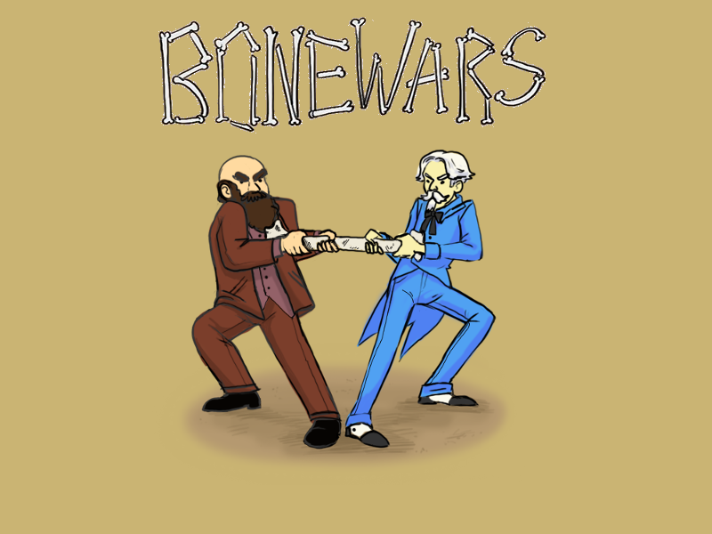
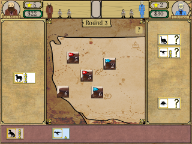

# The Bone Wars

by Bone Head Studio, a multidisciplinary undergraduate game development team at [Ball State University](http://bsu.edu) under the mentorship of faculty member [Paul Gestwicki](http://www.cs.bsu.edu/~pvg)

[Play *The Bone Wars* online](http://www.cs.bsu.edu/homepages/pvg/games/2014/bonewars/)

&nbsp;&nbsp;

A free two-player hotseat strategy game based on the feud between historic 19th-century paleontologists O.C. Marsh and E.D. Cope. 
Who will earn the most fame in eight rounds?

An academic perspective on this project is presented in [*The Bone Wars: Design and Development, Social Media and Community*](http://meaningfulplay.msu.edu/proceedings2014/mp2014_submission_7.pdf),
which is published in the [Proceedings of the 2014 Conference on Meaningful Play](http://meaningfulplay.msu.edu/proceedings2014/).
