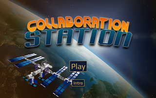
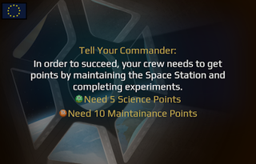
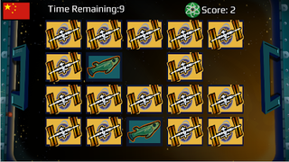
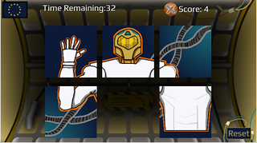

# Collaboration Station

by Space Monkey Studio, a multidisciplinary undergraduate game development team at [Ball State University](http://bsu.edu) under the mentorship of faculty member [Paul Gestwicki](http://www.cs.bsu.edu/~pvg)
[http://about.collaborationstationgame.info/](http://about.collaborationstationgame.info/)

&nbsp;&nbsp;

&nbsp;&nbsp;

&nbsp;&nbsp;

A cooperative Android game for 2&ndash;4 players about the International Space Station. Work together to make your mission a success!