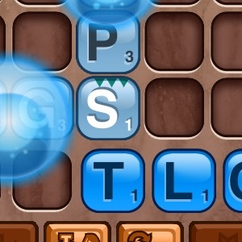

# Gallery

Here are a bunch of fine games made using PlayN, some commerical and some by hobbyists. Click the
images below for more details on each game.

If you want to add your game to the gallery, fork the [PlayN website repository], add a directory
for your game to the `/gallery/` section (along with a link on the index page) and submit a pull
request.

[PlayN website repository]: https://github.com/playn/playn.github.io
