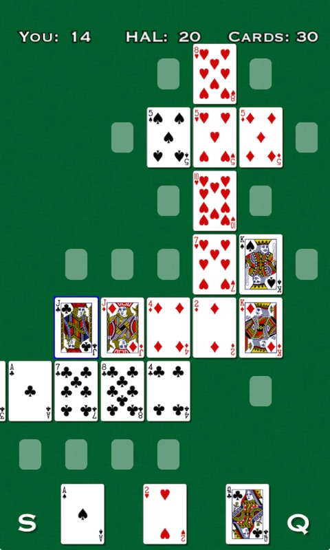
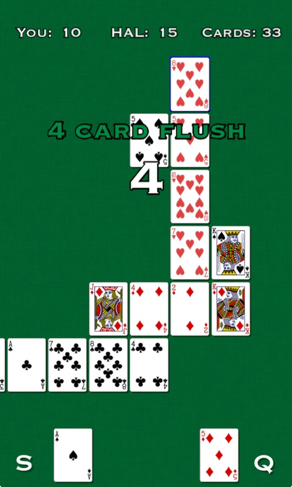

# Pokeros

by [Michael Bayne](http://samskivert.com/)  
[samskivert.com/pokeros](http://samskivert.com/pokeros/)  
[github.com/samskivert/mashups/tree/master/pokeros](https://github.com/samskivert/mashups/tree/master/pokeros)

&nbsp;&nbsp;

Pokeros is a mashup between Poker and Dominos. Lay down cards in an expanding grid to create poker
hands and outscore the computer opponent.
