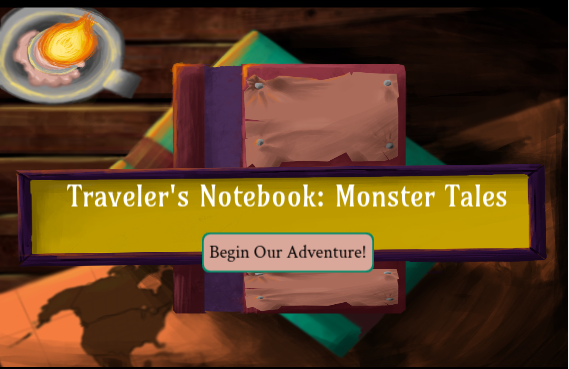
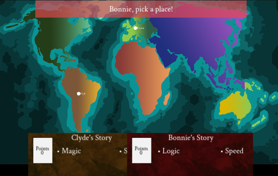
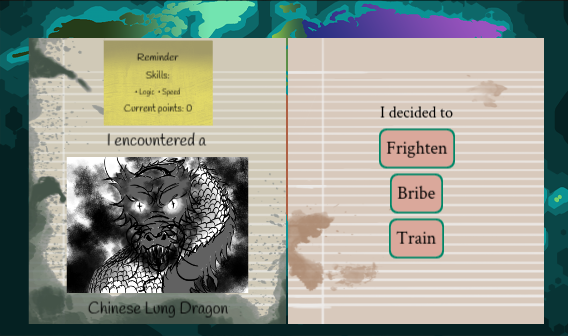

# Traveler's Notebook: Monster Tales

by [Studio 368](https://studio-368.github.io)
[github.com/studio-368/monsters](https://github.com/studio-368/monsters)

[Play *Traveler's Notebook: Monster Tales* online](https://studio-368.github.io/monsters)

&nbsp;&nbsp;

&nbsp;&nbsp;

*Traveler's Notebook: Monster Tales* is a free, two-player,
 narrative-rich game in which players encounter monsters from around
the world. More information can be found on
[the project web site](https://studio-368.github.io).