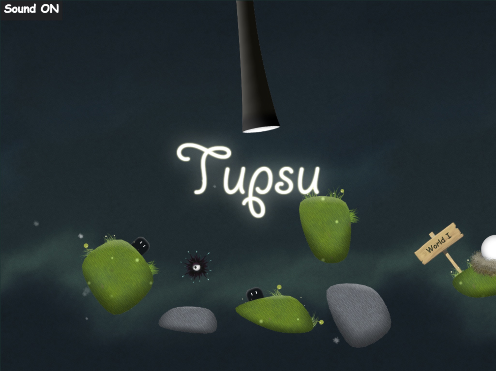

# Tupsu

by [Evgeni Gordejev](http://gabumba.com/)  
[gabumba.com/tupsu/Tupsu.html](http://gabumba.com/tupsu/Tupsu.html)

In Tupsu, you connect your cute furry little monster’s eyes to floating islands that advance him
closer to the stars he wants to collect. Levels offer a wide array of difficulty, some even quite
challenging even for advance players. Sometimes you have to think way outside the box to clear
levels.

